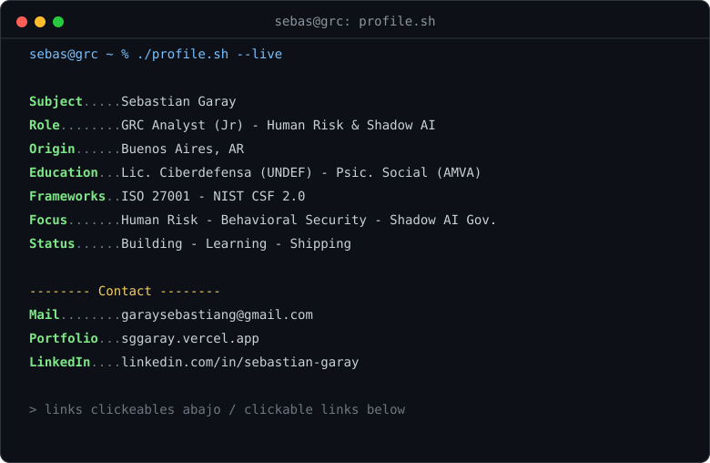

<picture>
  <source media="(prefers-color-scheme: dark)" srcset="dark.svg">
  <source media="(prefers-color-scheme: light)" srcset="light.svg">
  
</picture>

  
  
  

## About me

GRC analyst in training, focused on the intersection of **Human Risk Management**, **Shadow AI governance**, and **behavioral security**. I work in ISO 27001 and NIST CSF 2.0.

- Studying Cyberdefense (UNDEF) and Social Psychology (AMVA)
- Full clear at the Cisco Americas Cyber Games 2026 CTF, 37/37 flags with 0 hints, within the 3-hour window ([evidence](https://github.com/SGGaray/ctfs/tree/main/cisco-americas-cyber-games-2026))

---
